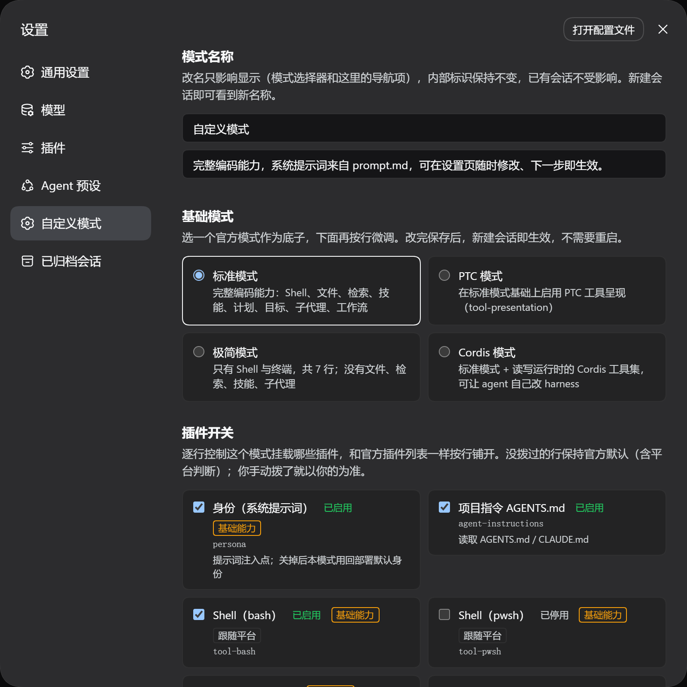
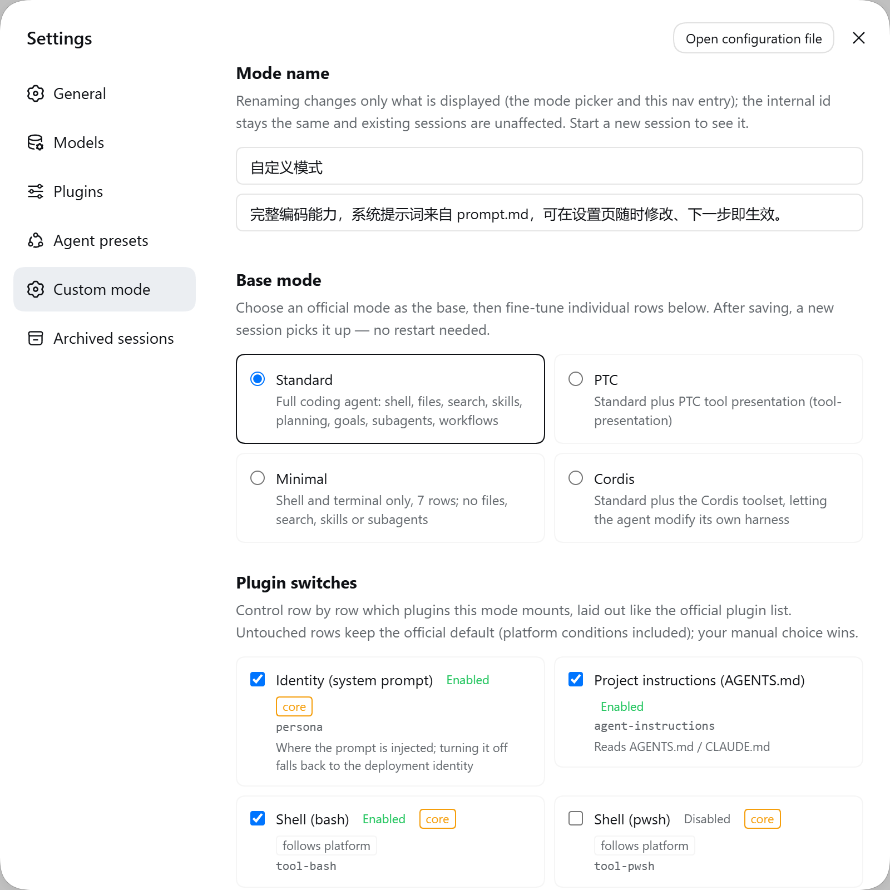
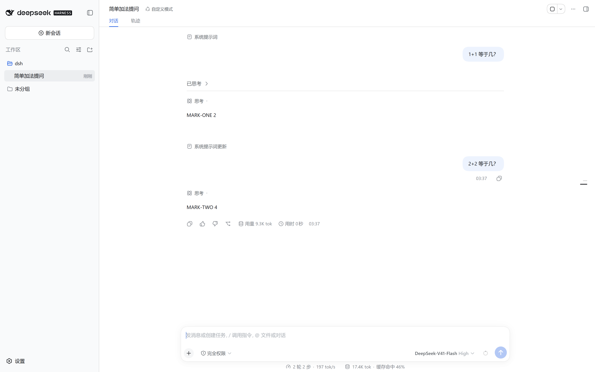

# dsh-custom-mode

English | [中文](README.zh.md)

A **custom mode** for [DeepSeek Harness](https://github.com/deepseek-ai/deepseek-harness) (dsh): an agent mode whose **system prompt is a plain file you can edit from the Web settings page**, plus a switch for every plugin row it mounts and a picker for which official mode it is built on.

The four official modes (`standard` / `ptc` / `minimal` / `cordis`) are untouched — this is a separate agent preset.


<sub>These screenshots are captured from a real running instance by the script under `tools/screenshots/`, which also asserts the state it observed — they are not mock-ups.</sub>

## Screens

The settings panel gains one section, in four parts:

|  |  |
| --- | --- |
|  |  |
| **Mode name + base mode**: rename it, build on standard / PTC / minimal / Cordis | **Plugin switches**: one tri-state switch per row; groups (those carrying an `isolate realm`) indent their children, and untouched rows read "follows platform" |
|  |  |
| **System prompt**: the status bar says when a save takes effect and which file it wrote | **New session**: it is a real, selectable mode |

Light/dark and both languages were verified the same way (official theme tokens and the `locale` service throughout):

|  |  |
| --- | --- |
|  |  |
| Dark mode | English UI (the nav entry follows the language) |

### The core claim, measured

The frame below is a real run (not a mock-up): a formatting rule was planted in the prompt (the first
line of every answer must be `MARK-ONE`), a question was asked, and then — **without restarting,
refreshing or starting a new session** — `prompt.md` was changed to `MARK-TWO` and a second question
was asked in the same session:



Note the **系统提示词更新** (system prompt updated) divider between the two turns: dsh itself flags
that the system prompt changed mid-session. Commands and raw output: [`docs/实测记录.md`](docs/实测记录.md) §0.

## The problem it solves

dsh's system prompt is written into a preset's `cordis.yml`. Changing it means editing YAML and restarting. The shipped `@deepseek-ai/dsh-persona` cannot help: its `prefix` is a **static string resolved at mount**, so editing a file would change nothing.

This project registers the same `deployment:persona-prefix` section but makes its `text` a **function**. dsh's agent loop reassembles the system prompt **before every model step**, so:

> edit the file → the next step uses the new text. No restart, no new session.

## Features

Settings → **自定义模式** has three blocks.

### 1. Mode name

Rename the mode and its description. Display only: the internal id (the preset directory) never changes, so existing sessions and file paths are unaffected. The roster is re-read on every listing, so a **new session** picks up the new name without a restart.

### 2. Base mode

Choose `standard` / `ptc` / `minimal` / `cordis` as the foundation, then fine-tune rows below.

The rows are **copied verbatim** from that mode's composition rather than inherited — shipped comments and `!!js` platform conditions are preserved byte-for-byte (text surgery, not a YAML parse/serialise round-trip). Two rows are enforced:

- `persona` is always replaced by this project's `./prompt-reader.mjs`; otherwise regenerating from an official mode would restore the static persona and the editable prompt would **silently stop working**.
- `custom-prompt-tool` is always appended, so a regeneration cannot drop the agent-facing editing path.

### 3. Plugin switches (one per row)

Row-by-row control over which plugins the mode mounts, laid out like the official plugin list. Groups (those carrying an `isolate` realm) span both columns with their children indented.

**The switch is tri-state, not a boolean** — this is the core of its correctness:

| State | Behaviour |
| --- | --- |
| untouched | Kept **exactly as shipped**, including `!!js` platform conditions and rows that ship disabled |
| explicitly on | The `disabled` key is removed, **platform expression included** (an explicit choice wins) |
| explicitly off | Written as `disabled: true`, replacing the platform expression |

Platform expressions are **evaluated on the host** (`process.platform === 'win32'` and friends), so the page shows the state actually in force on this machine. Without that, every platform row would read as "disabled" on every platform, and your own toggle of such a row would not be recorded at all.

## Install

```sh
git clone https://github.com/BOWLUNA/dsh-custom-mode
cd dsh-custom-mode
./install.sh                     # defaults to the `web` profile
./install.sh --profile tui       # or another profile
```

The script copies `preset/` into `$DSH_HOME/.agent-presets/custom/` (an agent preset is a **directory**, not an npm package) and installs the settings-page plugin into your profile via `dsh plugin add`.

**Restart dsh** afterwards (the browser bundle is discovered at boot), then pick 「自定义模式」 for a new session; the settings page appears under **自定义模式**.

Uninstall with `./uninstall.sh` (keeps your prompt by default; `--purge` removes it too).

## Usage

- **Settings page** — edit name, base mode, switches, and prompt. Saving writes the composition; a **new session** picks it up (the current one keeps its configuration, which is correct: swapping a tool set mid-conversation would be wrong).
- **Ask the agent** — the mode ships a `custom_prompt` tool: say "change my system prompt to …" in a fresh session.
- **Edit the file** — `$DSH_HOME/.agent-presets/custom/prompt.md` is the single source of truth.

Interpolation variables: `{{model}}`, `{{cwd}}`, `{{provider}}` only. The renderer is strict — an unknown or malformed `{{…}}` group makes it **throw**, failing every request in that mode. Both write paths therefore validate before writing.

## How a save takes effect

`agent-presets` compares the composition file's `mtimeMs` + `size` **on every session mount** and remounts when they differ. So a save reaches the **next new session** without restarting the process. The generated file always carries a timestamp so its size always changes.

## Development

Changes to the browser half (`editor/client.js`) are picked up by `@deepseek-ai/dsh-client-hmr` **about a second later with no restart and no page refresh** — it stat-polls each client bundle and hot-swaps the plugin. Only the host half (`index.mjs`, `composition.mjs`, `meta.mjs`) needs a restart.

```sh
node test/run.mjs
```

One entry point for five suites; it resolves the shipped-preset directory itself (three fallbacks,
and it prints which paths it tried when it fails):

| Suite | Checks | What it protects |
| --- | --- | --- |
| `test/composition.test.mjs` | 63 | the compiler: lossless text surgery, switch semantics, platform conditions, group indentation |
| `test/composition-edge.test.mjs` | 26 | the compiler on input the shipped files do not contain today: CRLF, no trailing newline, a row with no `name:`, deeper indentation, duplicate ids |
| `test/editor-route.test.mjs` | 50 | the host-half HTTP route — the fence runs **first**, fails **closed**, and every branch: 401/403/503, GET, POST, 405, bad JSON, bad mode, rejected interpolation, oversized body |
| `test/prompt-reader.test.mjs` | 15 | the hot-reload contract: an edit must be visible on the next evaluation, and a read failure must never blank the prompt |
| `test/prompt-tool.test.mjs` | 37 | the `custom_prompt` tool (the no-browser editing path), plus a drift guard on the two copies of the `{{…}}` validator |
| `test/meta.test.mjs` | 45 | `preset.yml` round-trip: quotes, backslashes, colons, newlines and emoji must read back exactly |
| `test/locales.test.mjs` | 65 | zh/en key parity, plus the **hand-copied dictionary** in `client.js` not drifting from `locales.mjs` |

CI (`.github/workflows/test.yml`) installs `@deepseek-ai/dsh@0.1.6-alpha.1` and runs all five, so the
tests always run against the **real shipped text** rather than a fixture of our own making.

The compiler tests assert **properties, not bytes**: the shipped text changes between dsh versions, but "changing nothing changes nothing" must always hold. During development they caught six real bugs, three of which were silent misbehaviour (lost platform conditions, ineffective group toggles, inverted switch semantics).

## Versioning

**This plugin's version mirrors the DSH version it targets** (currently `0.1.6-alpha.1`). Semantic versioning would be false precision here: what decides compatibility is whether a handful of internal APIs still exist, not the patch number. [`README.md`](README.md) (Chinese) lists all **11 coupling points** with the failure mode of each, so an upgrade can be checked off rather than re-derived.

## Documentation

- [`docs/ARCHITECTURE.md`](docs/ARCHITECTURE.md) — the measured findings: why the settings page **cannot** be a row of the preset, why `dsh.client.inject` is required, why a route registered on the raw `webServer` table is **outside** the platform's browser-trust fence (with the measured 401/403 evidence), and how to verify the browser hop without DevTools.
- [`docs/TROUBLESHOOTING.md`](docs/TROUBLESHOOTING.md) — failures reproduced on a real machine: a dsh that no longer boots after install, pnpm panicking under WSL, the settings page not appearing, the mode vanishing from the picker, rejected saves.
- [`docs/实测记录.md`](docs/实测记录.md) — the commands and raw output behind each claim (install, security, the save path, hot reload, i18n, tests).
- [`docs/PUBLISHING.md`](docs/PUBLISHING.md) — how to publish, and three hard lessons from surveying the existing plugin ecosystem.
- [`CHANGELOG.md`](CHANGELOG.md) — version history; [`SECURITY.md`](SECURITY.md) — known security issues and how to report one.

## License

MIT

---

# Project information

## Built with

| | |
| --- | --- |
| Model | DeepSeek V4.1 Flash (`deepseek-v4-flash`, provider `deepseek-official`) |
| Runtime | DeepSeek Harness **0.1.6-alpha.1** (`@deepseek-ai/dsh`, preview) |
| Target version | The same; this plugin mirrors the official version number |

## What it cost to build

As reported by the DSH client, for the whole project — research, measurements, dead ends and rework included:

| Metric | Value |
| --- | --- |
| Total tokens | **111,406,700** |
| Cache hit rate | **98%** |
| Uncached input | 2,603,266 |
| Cache read | 108,497,408 |
| Output | 306,026 |

Only ~306k tokens came out, against ~111M read in — **98% of it served from cache**. The ratio is the argument for the parts that look like overhead: running the tests, reading the runtime's own source, and checking every API against it. Those steps are what kept a wrong assumption from being written down as fact.
