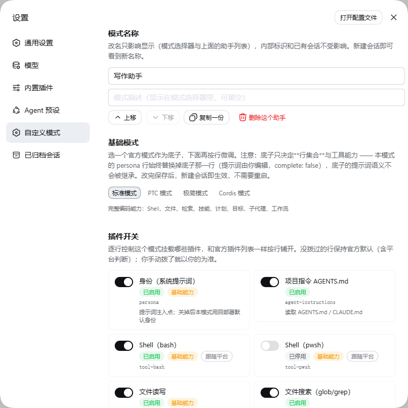
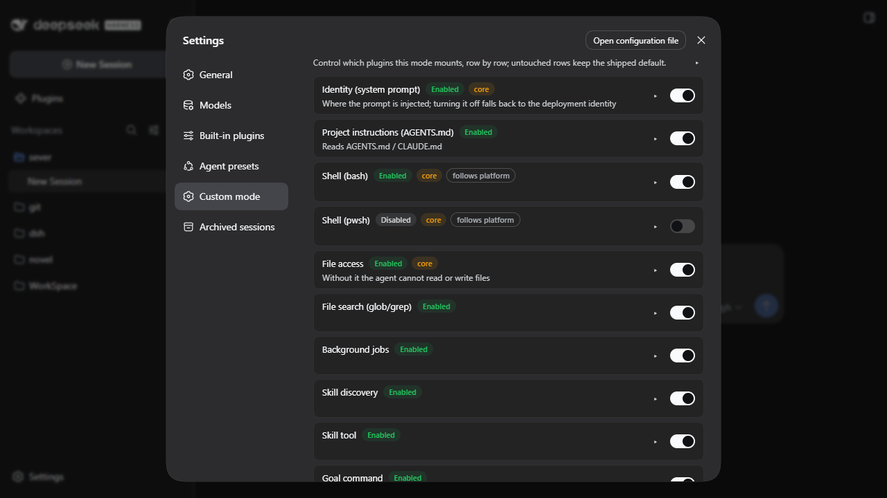
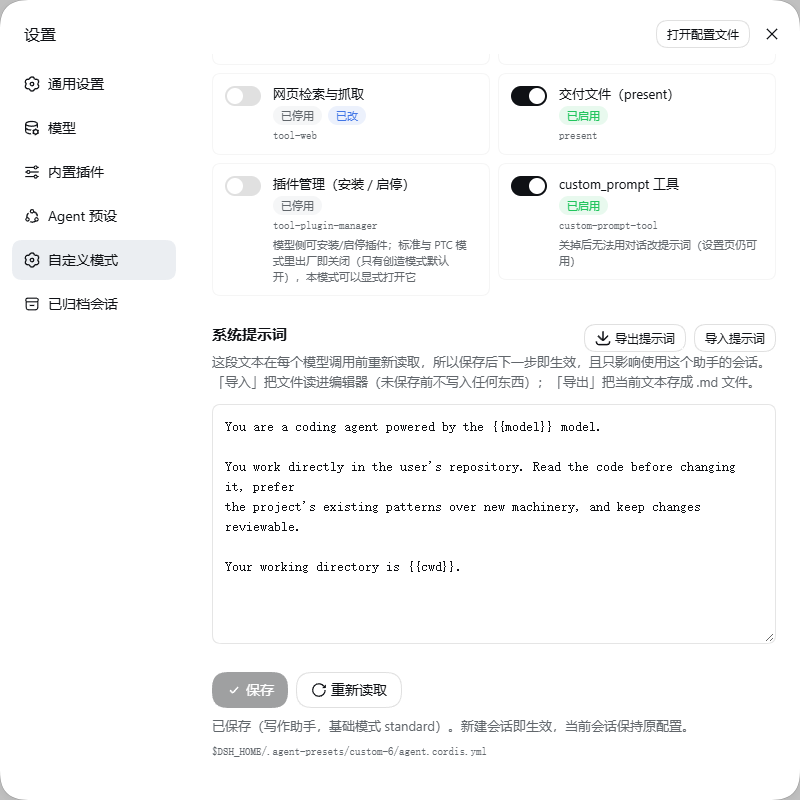
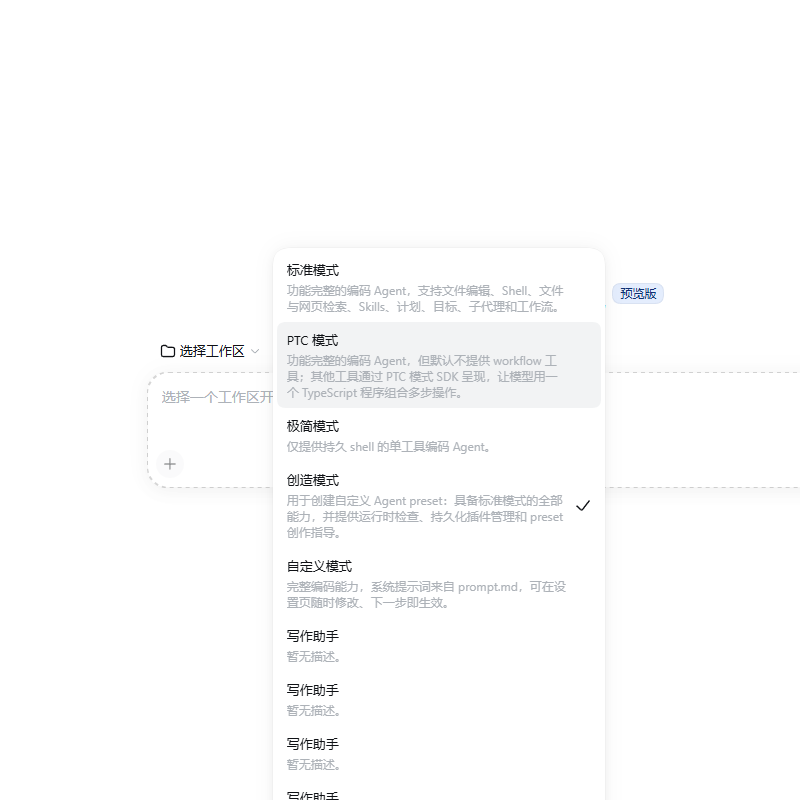
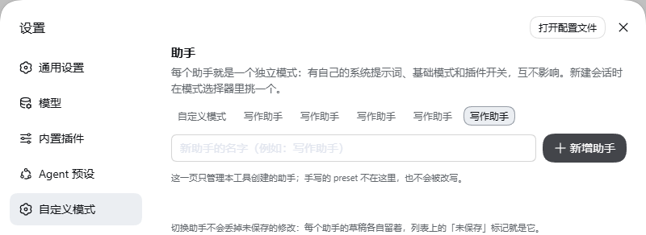

# dsh-custom-mode

English | [中文](README.zh.md)

A custom mode for [DeepSeek Harness](https://github.com/deepseek-ai/deepseek-harness) (dsh). Its
system prompt is a plain file you can edit on the Web settings page, and an edit takes effect on the
**next model step** — no restart, no new session.

In one line: **a settings page for dsh agent modes** — choose a mode's base composition, toggle the plugin
rows it mounts, and edit its system prompt, which the agent loop re-reads before every model step. Several
modes ("assistants") can live side by side, each with its own prompt.

Also searched for as: custom mode · custom prompt · system-prompt editor · multi-mode / several assistants.

The four official modes (`standard` / `ptc` / `minimal` / `cordis`) are untouched.

|  |  |
| --- | --- |
|  |  |
|  |  |

The assistant manager, cropped to its own section (captured on a real instance by
`tools/screenshots/run-shots.sh`; `tools/browser-verify.mjs` is what checks the page):



## Install

One command installs everything — the settings-page plugin, and the preset it seeds on first
activation:

```sh
dsh plugin --profile web add dsh-custom-mode
```

Restart dsh afterwards, then choose「自定义模式」for a new session. The preset is written to
`$DSH_HOME/.agent-presets/custom/`; anything already there is left alone, so a `prompt.md` you wrote
yourself is never overwritten.

**Platforms**: the suite runs on every push under Ubuntu (Node 20 and 24) **and Windows (Node 24)** — the
Windows job exists because that platform has its own failure modes (MSYS paths in `install.sh`, `rename`
locking under concurrent saves, platform expressions evaluating the other way). Both shell scripts work in
any POSIX shell, Git Bash included.

### Installing from the interface (no terminal)

From dsh `0.1.6-alpha.2` there is a Plugins page: **sidebar → Plugins → Add plugin**. It takes three
kinds of input, and all three work here:

| Input | What to paste |
| --- | --- |
| **Package name** | `dsh-custom-mode` |
| **GitHub repository URL** | `https://github.com/BOWLUNA/dsh-custom-mode` (the repository root) |
| **Local plugin directory** | `<your clone>/editor` — note `editor/`, not the repository root |

They work because the repository's **root** `package.json` declares `dsh.bundle`, `main` and
`exports["./client"]` pointing into `editor/`. The root and `editor/package.json` must describe one
plugin, so `test/manifests.test.mjs` asserts they agree on name, version and every declared path —
two manifests describing one thing is a drift hazard, and a test is cheaper than remembering.

To keep the sources around as well — or to install without npm — clone and run the script, which does
the same two things explicitly:

```sh
git clone https://github.com/BOWLUNA/dsh-custom-mode
cd dsh-custom-mode
./install.sh            # copies preset/ into $DSH_HOME/.agent-presets/custom/ and installs the plugin
./uninstall.sh          # removes the plugin; keeps your prompt unless you pass --purge
```

The mode needs a profile that ships `agent-presets` — the `web` profile does, `tui` and `headless` do
not.

## Usage

The settings page (Settings → "Custom mode") is an **assistant manager**: the top of the page lists
every custom mode you have — create, switch, delete — and the four blocks below (name, base mode,
plugin switches, system prompt) edit **whichever one is selected**.

- **Ordering** — "Move up / Move down" writes the order into each assistant's `preset.yml` (`order`,
  the roster's own sort key), so it survives a restart and the new-session picker follows it.
- **Import / export a prompt** — "Export prompt" saves the current text as a `.md`; "Import prompt"
  reads a file into the **editor** (nothing is written until you save), so an import goes through the
  same `{{…}}` validation as anything typed.
- **New assistant** — type a name and click "New assistant". It is seeded from the packaged template:
  the full Standard row set plus a starter prompt, selectable in a new session as soon as you save it.
- **Duplicate** — copies the selected assistant's prompt, base mode and row switches into a new one;
  the two are independent afterwards.
- **Each assistant is independent** — its prompt, base mode and row switches are its own; changing one
  leaves the others alone.
- **Base mode is the row set, not the prompt** — it decides which rows exist and which tools the mode has;
  this plugin always replaces the base's `persona` row with its own reader (`complete: false`), so the
  base's *prompt* semantics are **not** inherited. Minimal is the visible case: you get minimal's tool set,
  not minimal's prompt.
- **Switching assistants never discards drafts** — each keeps its own unsaved edits, marked
  "Unsaved" in the list; the only path that throws edits away is the reload button, which renames
  itself to say so.
- **Delete** — the shell's own risk-confirmation dialog, which requires ticking an acknowledgement.
  Deletion only removes the mode directory from disk: **sessions already using it keep running** (their
  composition was read when they started), and new sessions no longer offer it.
- **Ask the agent** — every assistant ships a `custom_prompt` tool, so a session can read or rewrite
  **its own** prompt.
- **Edit the file** — `$DSH_HOME/.agent-presets/<assistant id>/prompt.md` is that assistant's single
  source of truth.

Only `{{model}}`, `{{cwd}}` and `{{provider}}` are interpolated. An unknown `{{…}}` is rejected when
saved: the renderer throws on it, which would fail every request in that mode.

Every control (buttons, inputs, switches, tags, the confirmation dialog, icons) comes from the
shell's own `@deepseek-ai/dsh-client-ui-primitives`, so theme, light/dark and future restyling reach
this page automatically; a shell that does not provide those atoms falls back to built-in plain
controls with the same behaviour.

An "assistant" is **one directory** under the user preset root (default `$DSH_HOME/.agent-presets/`),
and its directory name is its internal id. The page manages only **presets this tool created** — the
test is that the directory carries `prompt.md` and that its composition injects identity through
`prompt-reader.mjs`. Any other hand-authored preset is neither listed nor touched: the page
regenerates a composition from a base mode, and doing that to a hand-written one would destroy it.

### How this differs from the built-in Plugins page

From dsh `0.1.6-alpha.2` the harness ships a Plugins page that can enable and disable plugins live.
It and this mode's per-row switches act at **different levels**:

| | Built-in Plugins page | This mode's per-row switches |
| --- | --- | --- |
| Scope | **The whole profile** — what this machine has installed | **One agent mode** — which rows its composition mounts |
| Typical use | Turn a plugin off globally | Keep Standard fully loaded and trim this mode to what it needs |

They coexist: the harness decides what the machine has, this mode decides which of it the mode uses.

The boundary is **drawn by upstream**: the Plugins page documents that it manages "the profile's bundles
and their uniquely addressable rows", and states plainly that **agent-preset rows remain read-only**.
The preset layer is therefore out of its reach — and that is exactly the layer this mode covers.

A demonstrable example: `tool-plugin-manager` (the agent-facing install/toggle tool) ships **off in
Standard and PTC** — only Creator enables it. The official modes give you no way to change that; here
you flip one switch.

## How it works

dsh normally takes the system prompt from a preset's YAML, and `@deepseek-ai/dsh-persona` resolves its
`prefix` once at mount. This preset registers the same `deployment:persona-prefix` section but makes
its `text` a **function**, which the agent loop calls before every model step.

Two different things therefore decide when a change lands:

- **Prompt text** is re-read per step, so an edit applies to the **running** session immediately.
- **Switches and base mode** rewrite the composition file. `agent-presets` remounts a preset when that
  file's `mtimeMs` and `size` change, so a **new session** picks them up; a running session keeps the
  configuration it started with, which is deliberate — swapping a tool set mid-conversation would be wrong.

Row switches are tri-state. A row you never touched stays byte-identical to the shipped one, including
its `!!js` platform condition and its shipped `disabled` state; an explicit on/off replaces that
condition with a boolean. Platform expressions are evaluated on the host, so the page shows the state
actually in force on this machine rather than whether a key exists.

Several assistants need no new mechanism: `dsh-agent-presets` already scans **every** directory under
the user preset root, and re-reads those roots on each roster call, so a directory created just now is
selectable the next time a session is started. Each assistant's `prompt-reader.mjs` / `prompt-tool.mjs`
resolves `prompt.md` relative to **its own module location**, so N copies are N independent prompts.
Creation seeds the packaged template; deletion goes through the platform's `agentPresets.remove()`,
which refuses a shipped preset and re-checks that the directory really lives under the writable root.

## Versioning

The package version is its **own line** — `1.0.0`, then `1.0.1`, … It does not mirror the DSH release.
What this plugin supports is declared in `engines.dsh` and the `@deepseek-ai/dsh` peer range in
`editor/package.json`, and `tools/verify-version-consistency.mjs` (run in CI) asserts that the DSH
version CI installs and tests falls inside those ranges.

Two reasons for the split. A bare `x.y.z` is what directories and markets require before they will
auto-install a package — several resolve npm `latest` and reject anything carrying a prerelease tag.
And a version string was never a checkable claim anyway: the declared range is, and it is the thing
that goes stale when upstream moves. What decides compatibility in practice is still whether the APIs
below exist, which is what the ranges are for.

<details>
<summary>Coupling points (check these when upgrading dsh)</summary>

| Dependency | Failure if it changes |
| --- | --- |
| `ctx.systemPrompt.section()` with a **function** `text` | the prompt stops hot-reloading — the point of the project |
| `agentPresets` remounts on composition `mtimeMs`+`size` | switches need a process restart to apply |
| `ctx.tools.register()` | loses the `custom_prompt` tool |
| `ctx.connection.fetch.register({ path, methods, requestBody, fetch })` | settings page 404s — nothing is registered |
| `kind: 'prefix'` matching both `path` and `path/…` | only the list opens; `/state`, `/create`, `/delete` all 404 |
| `agentPresets.list()` rows carrying `id` / `trust` / `path`, with `preset.yml` supplying `name` / `description` | the assistant list is empty or unrecognisable |
| `agentPresets.remove(id)`, refusing `trust: 'system'` | deletion fails (the page shows the platform's reason) |
| the `/api` channel's fence (Host/Origin + browser auth) | the page cannot authenticate at all; do **not** "fix" it by moving the route to the raw `webServer` table |
| `ctx.inject(deps, cb)` (scoped wait) | the row parks in `pending` in profiles without a web server |
| `dsh.client` + `exports["./client"]`, client bundle id == package name | the browser half is not discovered |
| `settings.section` slot (`id` / `order` / `label`) | page placement and label |
| **`settings.section` no longer takes `locale:`** (since 0.1.6-alpha.2) | the shell does not hand over a `t` bound to this namespace; the page carries its own dictionaries as a floor — see ARCHITECTURE §15 |
| `preset.yml`'s `order` participating in the roster sort | move up/down stops working |
| `ctx.locale.register/bind` | falls back to Chinese |
| shipped layout `<presets>/<id>/agent.cordis.yml` and row text shape | base-mode switching breaks |
| `!!js` platform expressions | platform rows display the wrong state |

</details>

## Documentation

- [`docs/TROUBLESHOOTING.md`](docs/TROUBLESHOOTING.md) — failures reproduced on a real machine, with symptoms, cause and a way out.
- [`docs/MEASUREMENTS.md`](docs/MEASUREMENTS.md) — the commands and raw output behind each claim.
- [`docs/ARCHITECTURE.md`](docs/ARCHITECTURE.md) — why this is two artifacts, and which host APIs it depends on.
- [`docs/PUBLISHING.md`](docs/PUBLISHING.md) — how the npm package is published.
- [`AGENTS.md`](AGENTS.md) — agent-facing notes, including the full recipe for verifying the UI in a
  real browser on the lab (`tools/browser-verify.mjs`).
- [`CHANGELOG.md`](CHANGELOG.md) · [`SECURITY.md`](SECURITY.md) · [`CONTRIBUTING.md`](CONTRIBUTING.md)

## Development

```sh
node test/run.mjs        # 11 suites, 521 checks; resolves the shipped presets itself
```

Edits to `editor/client.js` are hot-swapped by `@deepseek-ai/dsh-client-hmr` about a second later; the
host half (`index.mjs`, `composition.mjs`, `meta.mjs`, `paths.mjs`) needs a restart. See
[`test/README.md`](test/README.md) for what each suite protects, and [`CONTRIBUTING.md`](CONTRIBUTING.md)
before changing behaviour.

## License

MIT

---

## Built with

| | |
| --- | --- |
| Model | DeepSeek V4.1 Flash (`deepseek-v4-flash`, provider `deepseek-official`) |
| Runtime | DeepSeek Harness **0.1.6-alpha.2** (`@deepseek-ai/dsh`, preview) |
| Uncached input | 224,058 tok |
| Cache reads | 125,638,016 tok |
| Output | 425,539 tok |

The whole project, research and dead ends included, cost the DSH client **126,287,613 tokens** at a
**99.8%** cache hit rate (cache reads ÷ all input, 125,862,074).
